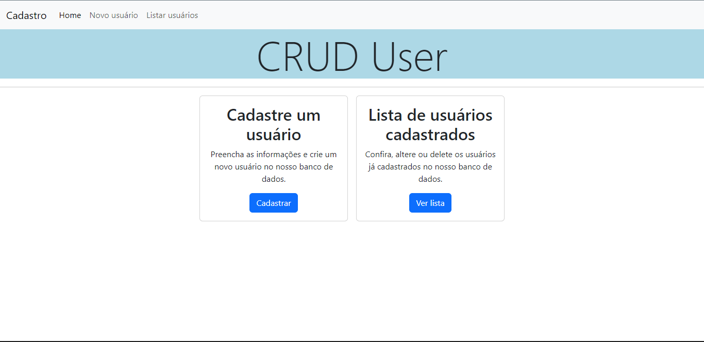

# README

CRUD com PHP e MySQL no contexto de usuários feito por [João Pedro Monção](https://github.com/jpmoncao). Tendo funcionalidades de cadastrar, listar, alterar e deletar usuários.
Meu primeiro projeto CRUD com PHP para fins educativos.

##

<div id="demo">
  ## 🚀Demo
  
  
</div>


<!-- <div id="executando">
  ## ⏩Executando
  
  ```bash
    python -m venv venv
  
    venv/Scripts/Activate.ps1
  
    pip install tkinter
  
    cd C:/Users/seu-user/pasta-do-arquivo/main.py
  
    python main.py
  ```
</div> -->
    
<!-- <div id="variaveis">
  ## 🧮Variáveis de Ambiente
  
  Para rodar esse projeto, você vai precisar adicionar as seguintes variáveis de ambiente no seu .env
  
  `API_KEY`
  
  `ANOTHER_API_KEY`
</div> -->


<div id="melhorias">
  ## ✔️Melhorias
  - CREATE: Validação dos dados, alerta toast para confirmar cadastro;
  - READ: Barra de procura para dados;
  - UPDATE: Confirmar alteração pela senha, alterar senha, alerta toast para confirmar alteração;
  - DELETE: Modal personalizado de confirmação de exclusão.
</div>

<div id="stack">
  ## 💻Stack utilizada
  - **Front-end:** Bootstrap 5
  - **Back-end:** PHP
  - **Banco de dados:** MySQL
</div>

<div id="habilidades">
## 🛠 Habilidades
- PHP
  - Requisição
  - Formulários
  - Páginação
  - CRUD
  - Conexão com BD
  - Básico da lógica
</div>
 
<div id="sobre">
  ## 🚹 Sobre mim
  Eu sou João Pedro Monção, tenho 16 anos e atualmente estou cursando técnico em Informática. Estou estudando desenvolvimento web! Espero que curta o projeto deste repositório e aproveite para conferir meu perfil...
</div>


<div id="links">
  ## 🔗 Links
  [](https://jpmoncao.netlify.app)
  [](https://www.linkedin.com/in/jpmoncao/)
  [](https://github.com/jpmoncao)
</div>


<div id="suporte">
  ## 📞Suporte
  
  Para suporte, mande um email para pedrohjoao44@gmail.com
  
  ##
</div>

<p align="center">Índice</p>
<p align="center">
  <a href="demo">🚀Demo, </a>
  <a href="executando">⏩Executando, </a>
  <a href="variaveis">🧮Variáveis de Ambiente, </a>
  <a href="melhorias">✔️Melhorias, </a>
  <a href="stack">💻Stack utilizada, </a>
  <a href="habilidades">🛠 Habilidades, </a>
  <!-- <a href="referencia">📖Referência, </a> -->
  <a href="sobre">🚹 Sobre mim, </a>
  <a href="links">🔗Links e </a>
  <a href="suporte">📞Suporte </a>
</p>

##

<p align="center">🚧Projeto finalizado - aberto a melhoras🚧</p>


<!-- MUDAR ÍNDICE -->